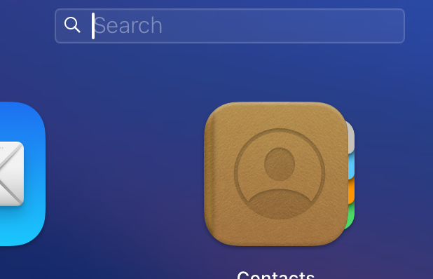

现官方clouddrive2已有app
请关注cd2频道：
https://t.me/cloud_nas
此脚本原作者好像删库了~之前fork的
改掉链接还可用,就先这么留着了【若是用不了请翻墙或者自己在http前+镜像加速链接】
# 一键安装 Clouddrive2 脚本
脚本非官方出品，由于官方帮助不适合新手故写此脚本。指在帮助新手用户快速使用 clouddrive2 挂载网盘。
 
## 目录
- [一键安装 Clouddrive2 脚本](#一键安装-clouddrive2-脚本)
  - [目录](#目录)
  - [安装](#安装)
    - [安装命令](#安装命令)
    - [卸载命令](#卸载命令)
  - [安卓](#安卓)
    - [安装 (未ROOT设备)](#安装-未root设备)
    - [安装 (已ROOT设备)](#安装-已root设备)
    - [卸载](#卸载)
  - [如何更新?](#如何更新)
  - [在哪运行？](#在哪运行)
    - [OpenWRT](#openwrt)
    - [Mac](#mac)
    - [Linux](#linux)
    - [安卓](#安卓-1)
  - [问与答](#问与答)
    - [通规问题](#通规问题)
    - [安装问题](#安装问题)
    - [安装后问题](#安装后问题)
    - [安卓问题](#安卓问题)


支持
- [X] Linux
- [X] MacOS
- [X] OpenWRT
- [X] Android-Termux
- [X] 理论上支持所有安装了 docker 的设备如: iStore OS
- [X] 理论上支持所有 OpenWRT 及其衍生的系统

## 安装
### 安装命令
Mac、Linux、OpenWRT等 在「终端」运行下面的「命令」
 
不知道在哪里运行这些命令？[点击查看](#在哪运行)

```shell
curl -fsSL "https://https://raw.githubusercontent.com/cshczh/clouddrive2/main/cd2.sh" | bash -s install
```

### 卸载命令
```shell
curl -fsSL "https://https://raw.githubusercontent.com/cshczh/clouddrive2/main/cd2.sh" | bash -s uninstall
```

## 安卓
安卓在termux里运行下面的「命令」

### 安装 (未ROOT设备)
```shell
curl -fsSL "https://raw.githubusercontent.com/cshczh/clouddrive2/main/cd2-termux.sh" | bash -s install
```

### 安装 (已ROOT设备)
```shell
curl -fsSL "https://raw.githubusercontent.com/cshczh/clouddrive2/main/cd2-termux.sh" | bash -s install root
```

### 卸载
```shell
curl -fsSL "https://raw.githubusercontent.com/cshczh/clouddrive2/main/cd2-termux.sh" | bash -s uninstall
```

## 如何更新?
请使用官方内置的更新方式: 点击右上角的`!`号


## 在哪运行？
### OpenWRT
在左侧菜单里一般有「终端」或「TTYD 终端」，登录用户名一般为root，密码为你的OP密码。  
如果没有, 请使用 ssh 连接.


### Mac
打开「启动器」在上面的「搜索框」搜索「终端」或「terminal」  
 
第1步  

   
第2步  
 
   

### Linux
Linux 桌面环境下的「终端」名称不同, 可自行查找

### 安卓
打开「Termux」输入命令


## 问与答
这里解决的问题主要来源于群友的反馈

### 通规问题
是否需要开代理？  
> 需要。脚本已冇了镜像加速。
 
cd2安装在了哪里?   
> docker默认挂载点在 /CloudNAS  
> 安卓默认安装在/data/data/com.termux/files/home/clouddrive/
> 其它平台默认安装在 /opt/clouddrive/  

### 安装问题
提示：curl: (35) Recv failure: Connection reset by peer  
> 重启「终端」  

### 安装后问题
登录一直提示连接超时
> 用「卸载命令」再重装

### 安卓问题
为什么 termux 无法挂载网盘到本地？  
> 非Root用户无法挂载。
  
非 root 设备可以用 root 命令吗？  
> 不可以，用了会无法启动。
